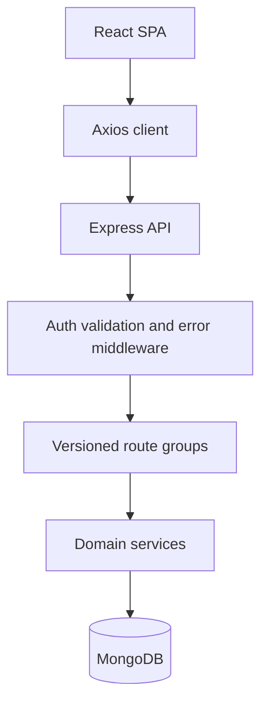

# Blogging Platform

A MERN blogging platform with a React frontend, an Express REST API, and MongoDB persistence. It supports account access, post publishing, comments, profiles, and admin user management.

## Overview

The application is split into two independently runnable npm packages. `Frontend` is a Vite-powered React single-page application. `Backend` is an Express 5 API that connects to MongoDB through Mongoose and exposes versioned routes under `/api/v1`.

The frontend uses Redux Toolkit for authentication and UI state, Axios for API requests, and React Router for public, guest-only, authenticated, and admin routes. The backend separates routes, controllers, services, models, validators, and middleware.

## Features

- Register and log in with an email, username, and password.
- Restore a session, refresh access tokens, and log out.
- Browse, search, sort, paginate, create, edit, and delete posts.
- View posts by slug or MongoDB ID and browse posts by user.
- Read, add, and delete post comments.
- View and update the authenticated user's profile.
- Allow admin users to list and delete users.

## Tech Stack

| Area | Implementation |
| --- | --- |
| Frontend | React `19.2.8`, React Router `7.18.4`, Vite `8.3.0` |
| Backend | Node.js with Express `5.2.1` and ES modules |
| Database | MongoDB with Mongoose `9.9.5` |
| Authentication | JSON Web Tokens with `jsonwebtoken`; `bcryptjs` password and refresh-token hashing |
| State management | Redux Toolkit `2.12.0`, React Redux `9.3.0` |
| API / networking | Axios `1.20.0` with credentials and interceptors |
| Validation | Joi `18.2.9` on the API; Zod `4.6.5` and React Hook Form on the frontend |
| Styling | Custom CSS; `lucide-react` icons |
| Testing | Jest `30.5.1`, Supertest `7.2.2`, and `mongodb-memory-server` as a backend dev dependency |
| Development tools | Nodemon `3.1.14`, Oxlint `1.81.0` |

## Architecture

The browser sends requests through the Axios client in `Frontend/src/lib/axios.js`. The client attaches the in-memory access token as a Bearer token and sends cookies with requests. Express mounts route groups at `/api/v1`; controllers delegate work to services, and services read or mutate Mongoose models. Successful responses use `{ success, message, data }`, with pagination metadata inside `data.pagination`.



## Project Structure

```text
.
├── Backend/
│   ├── src/
│   │   ├── config/          Environment and database configuration
│   │   ├── controllers/     HTTP request handlers
│   │   ├── middleware/      Authentication, validation, rate limits, errors
│   │   ├── models/          User, Post, and Comment schemas
│   │   ├── routes/          Versioned API route groups
│   │   ├── services/        Domain operations
│   │   ├── utils/           Tokens, responses, pagination, and helpers
│   │   └── validators/      Joi request schemas
│   ├── scripts/             Admin seed script
│   └── tests/               Jest integration and unit tests
└── Frontend/
		└── src/
				├── components/      Shared UI and layout components
				├── features/        Auth, posts, comments, users, and admin slices
				├── lib/              Axios API client
				├── router/           Route configuration and guards
				└── app/              Redux store configuration
```

## Getting Started

### Prerequisites

- Node.js. The repository does not declare a Node.js version or `engines` field.
- npm, because each package has an `npm` lockfile.
- A running MongoDB instance. The supplied development example uses a local MongoDB database at `mongodb://localhost:27017/blogging_platform`.

### Clone and install

```bash
git clone <repository-url>
cd Blogging_Platform
cd Backend
npm install
cd ../Frontend
npm install
```

### Configure the backend

From `Backend`, copy `.env.example` to `.env.development` because the development script loads that filename:

```powershell
Copy-Item .env.example .env.development
```

Replace the example secrets before using the application. The backend example is configured for port `5000` and permits the frontend origin `http://localhost:5173`.

### Configure the frontend

From `Frontend`, copy the example environment file to `.env`:

```powershell
Copy-Item .env.example .env
```

The example points the client at `http://localhost:5000/api/v1`.

### Seed an admin user

After MongoDB is running and the backend environment is configured:

```bash
cd Backend
npm run seed:admin
```

The seed script reads `ADMIN_USERNAME`, `ADMIN_EMAIL`, and `ADMIN_PASSWORD`, then creates or promotes that user to the `admin` role.

### Run the applications

Run each package in a separate terminal. The scripts use Windows `set` syntax.

```bash
cd Backend
npm run dev
```

```bash
cd Frontend
npm run dev
```

The API listens on port `5000` from the development example. The frontend example and backend CORS setting use `http://localhost:5173`.

Other declared scripts are:

```bash
cd Backend
npm start
npm test
```

```bash
cd Frontend
npm run build
npm run lint
npm run preview
```

## Environment Variables

### Backend

| Variable | Required | Description | Example |
| --- | --- | --- | --- |
| `NODE_ENV` | Yes | Selects development, test, or production configuration | `development` |
| `PORT` | Yes | API listening port | `5000` |
| `CORS_ORIGIN` | Yes | Allowed browser origin | `http://localhost:5173` |
| `MONGODB_URI` | Yes | MongoDB connection string | `mongodb://localhost:27017/blogging_platform` |
| `ACCESS_TOKEN_SECRET` | Yes | Signs access JWTs | `your_access_secret` |
| `ACCESS_TOKEN_EXPIRY` | Yes | Access JWT lifetime | `15m` |
| `REFRESH_TOKEN_SECRET` | Yes | Signs refresh JWTs | `your_refresh_secret` |
| `REFRESH_TOKEN_EXPIRY` | Yes | Refresh JWT lifetime | `7d` |
| `ADMIN_USERNAME` | Yes | Seeded admin username | `admin` |
| `ADMIN_EMAIL` | Yes | Seeded admin email | `admin@example.com` |
| `ADMIN_PASSWORD` | Yes | Seeded admin password | `your_admin_password` |

### Frontend

| Variable | Required | Description | Example |
| --- | --- | --- | --- |
| `VITE_API_BASE_URL` | No | API base URL; the client has the same local default | `http://localhost:5000/api/v1` |

## API Documentation

The API prefix is `/api/v1`. The health endpoint is `GET /`. Protected routes require `Authorization: Bearer <access-token>` unless noted otherwise.

### Auth

| Method | Path | Access | Purpose and body |
| --- | --- | --- | --- |
| `POST` | `/api/v1/auth/register` | Public | Register with `username`, `email`, `password`; returns `201` and sets a refresh cookie. |
| `POST` | `/api/v1/auth/login` | Public | Authenticate with `email`, `password`; returns `200` and sets a refresh cookie. |
| `POST` | `/api/v1/auth/refresh` | Refresh cookie | Rotate the refresh cookie and return a new access token. |
| `POST` | `/api/v1/auth/logout` | Authenticated | Invalidate the stored refresh token and clear the cookie. |

### Posts and comments

| Method | Path | Access | Purpose and body/query |
| --- | --- | --- | --- |
| `GET` | `/api/v1/posts` | Public | List posts. Query: `page`, `limit` up to `50`, `search`, `tag`, `sort=newest\|oldest`. |
| `POST` | `/api/v1/posts` | Authenticated | Create with `title`, `body`, and optional `tags`; returns `201`. |
| `GET` | `/api/v1/posts/:id` | Public | Fetch a post by ID or slug. |
| `PUT` | `/api/v1/posts/:id` | Post owner | Update a post with the validated update payload. |
| `DELETE` | `/api/v1/posts/:id` | Owner or admin | Soft-delete a post. |
| `GET` | `/api/v1/posts/:postId/comments` | Public | List paginated comments with `page` and `limit`. |
| `POST` | `/api/v1/posts/:postId/comments` | Authenticated | Create a comment with `body`; returns `201`. |
| `DELETE` | `/api/v1/posts/:postId/comments/:commentId` | Comment owner or admin | Delete a comment. |

### Users and administration

| Method | Path | Access | Purpose and body/query |
| --- | --- | --- | --- |
| `GET` | `/api/v1/users/me` | Authenticated | Return the current user profile. |
| `PUT` | `/api/v1/users/me` | Authenticated | Update the current profile. |
| `GET` | `/api/v1/users/:id/posts` | Public | List a user's paginated posts. |
| `GET` | `/api/v1/admin/users` | Admin | List paginated users. |
| `DELETE` | `/api/v1/admin/users/:id` | Admin | Soft-delete a user. |

Successful responses have this shape:

```json
{
	"success": true,
	"message": "Post fetched successfully",
	"data": {
		"post": {}
	}
}
```

Paginated responses add `data.pagination` with `currentPage`, `totalPages`, `totalItems`, `limit`, `hasNextPage`, and `hasPrevPage`. Errors use `success: false`, a `message`, and an `errors` array.

## Authentication

1. Registration and login validate their bodies with Joi and issue an access JWT plus a refresh JWT.
2. The refresh JWT is stored in an `httpOnly`, `SameSite=Strict` `refreshToken` cookie. The database stores a bcrypt hash of that token, not the raw token.
3. The access JWT is kept in Redux memory by the frontend and attached as a Bearer header by Axios.
4. The backend verifies the access JWT in `authenticate` middleware. Ownership and admin checks are applied in services and role middleware.
5. On a `401`, Axios performs one shared refresh request, updates the in-memory access token, and retries the original request. Refresh rotates the cookie and rejects token reuse.
6. Logout clears the stored refresh token and the cookie.

## Engineering Highlights

- Feature-oriented frontend modules keep API functions, pages, hooks, and state close to their domain.
- Backend controllers delegate to services, keeping HTTP response construction separate from domain operations.
- Mongoose schemas model `User`, `Post`, and `Comment` references, virtual post/comment relationships, timestamps, soft deletion, and indexes for common queries.
- Joi middleware rejects unknown request fields and returns field-level validation details.
- Centralized error middleware maps invalid IDs, Mongoose validation errors, duplicate keys, and unexpected errors to a consistent response envelope.
- Axios request and response interceptors centralize access-token attachment and refresh behavior.
- Auth and write operations use separate rate limits: 10 authentication requests per 15 minutes and 30 write requests per minute.

## Error Handling and Validation

Joi validates authentication, post, comment, and query inputs in route middleware. Mongoose validates model constraints such as required fields, string lengths, unique usernames/emails, post tags, and references. `asyncHandler` forwards rejected controller promises to the central error middleware.

The API returns `{ success: false, message, errors }` for errors. Validation errors contain field and message entries. The React application stores authentication errors in Redux and surfaces request failures through its UI components and toast state.

## Security Considerations

- Helmet sets common HTTP security headers.
- CORS is restricted to the configured origin and credentials are enabled for the refresh cookie.
- Mongo query values are sanitized before route handling.
- Passwords and refresh tokens are hashed with bcrypt cost `12`, and sensitive fields are excluded from normal model selection.
- Refresh cookies are `httpOnly`, `SameSite=Strict`, and `secure` in production.
- Authentication and write endpoints are rate limited.
- Admin and resource ownership checks are enforced on the backend.

## Future Improvements

- Fix the `GET /users/me` route applying a non-empty profile body schema to a GET request.
- Make post update handling consistently support the slugs used by public post links.
- Add frontend automated tests; the repository currently contains backend tests only.
- Add password reset, email verification, and account lockout flows.
- Add an explicit CSRF protection mechanism for cookie-authenticated refresh requests.

## License

The backend package declares the `ISC` license in `Backend/package.json`. No root `LICENSE` file is present.
